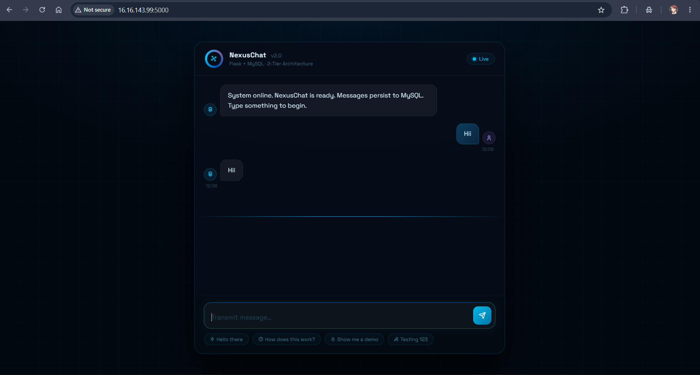

# NexusChat 🚀 — Flask + MySQL 2-Tier App

A futuristic real-time chat web application built with **Flask** (Python) and **MySQL**, containerization-ready and deployed as a 2-tier architecture.

---

## 📁 Project Structure

```
project/
├── app.py# Flask backend — routes, MySQL config
└── Dockerfile
└── message.sql
└── templates/
      └── index.html       # Frontend — futuristic dark UI with AJAX
    
```

## 📸 Screenshot


---

## ⚙️ Tech Stack

| Layer      | Technology              |
|------------|-------------------------|
| Backend    | Python 3, Flask         |
| Database   | MySQL                   |
| ORM/Driver | flask-mysqldb           |
| Frontend   | HTML, CSS, JavaScript (jQuery AJAX) |
| Deployment | Docker / AWS EC2 ready  |

---

## 🚀 Getting Started

### 1. Clone the Repository

```bash
git clone https://github.com/your-username/nexuschat.git
cd nexuschat
```

### 2. Install Dependencies

```bash
pip install flask flask-mysqldb
```

### 3. Set Environment Variables

```bash
export MYSQL_HOST=localhost
export MYSQL_USER=root
export MYSQL_PASSWORD=yourpassword
export MYSQL_DB=chatdb
```

### 4. Run the App

```bash
python app.py
```

App will be live at: `http://localhost:5000`

---

## 🗄️ Database Setup

The app auto-creates the `messages` table on startup via `init_db()`:

```sql
CREATE TABLE IF NOT EXISTS messages (
    id INT AUTO_INCREMENT PRIMARY KEY,
    message TEXT
);
```

No manual SQL setup needed.

---

## 🔌 API Endpoints

| Method | Route     | Description                        |
|--------|-----------|------------------------------------|
| GET    | `/`       | Load homepage with all messages     |
| POST   | `/submit` | Submit a new message (JSON response)|

### POST `/submit` — Request

```
Content-Type: application/x-www-form-urlencoded

new_message=Hello+World
```

### POST `/submit` — Response

```json
{
  "message": "Hello World"
}
```

---

## 🐳 Docker Deployment (Optional)

### Dockerfile

```dockerfile
FROM python:3.11-slim
WORKDIR /app
COPY . .
RUN pip install flask flask-mysqldb
EXPOSE 5000
CMD ["python", "app.py"]
```

### docker-compose.yml

```yaml
version: '3.8'
services:
  web:
    build: .
    ports:
      - "5000:5000"
    environment:
      MYSQL_HOST: db
      MYSQL_USER: root
      MYSQL_PASSWORD: rootpassword
      MYSQL_DB: chatdb
    depends_on:
      - db

  db:
    image: mysql:8.0
    environment:
      MYSQL_ROOT_PASSWORD: rootpassword
      MYSQL_DATABASE: chatdb
    ports:
      - "3306:3306"
```

```bash
docker-compose up --build
```

---

## 🌐 Environment Variables

| Variable         | Default          | Description            |
|------------------|------------------|------------------------|
| `MYSQL_HOST`     | `localhost`      | MySQL server host      |
| `MYSQL_USER`     | `default_user`   | MySQL username         |
| `MYSQL_PASSWORD` | `default_password` | MySQL password       |
| `MYSQL_DB`       | `default_db`     | MySQL database name    |

---

## ✨ Features

- Real-time message submission via AJAX (no page reload)
- Messages persisted to MySQL database
- Futuristic dark UI with animated scan line and typing indicator
- Auto-expanding textarea input
- Quick-reply hint pills
- Fully responsive (mobile-friendly)
- Docker and AWS EC2 deployment ready

---

## 🐛 Known Fix

In `app.py`, ensure `init_db()` has its `def` declaration:

```python
# ✅ Correct
def init_db():
    with app.app_context():
        ...

# ❌ Wrong — indented block without def (causes SyntaxError)
    with app.app_context():
        ...
```

---

## 👤 Author

**Aniket**   
GitHub: [@Aniket1288](https://github.com/Aniket1288)

---

## 📄 License

This project is for educational and internship demonstration purposes.
